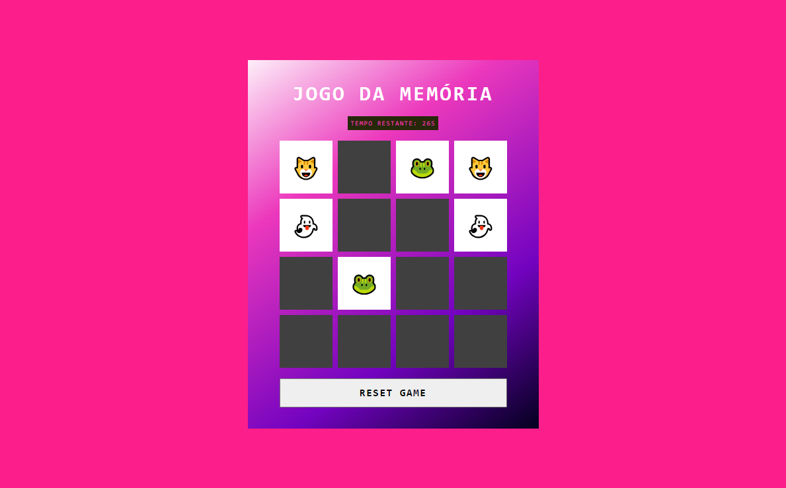

#  Jogo da Memória

Seja muito bem-vindo ao Jogo da Memória! Este jogo foi desenvolvido para treinar sua memória e agilidade. O objetivo é encontrar os pares de cartas correspondentes em um tempo limitado.



## Índice

- Objetivo
- Descrição do Projeto
- Como Jogar
- Tecnologias Utilizadas
- Estrutura do Projeto
- Funcionalidades
- Funcionalidades Futuras
- Contribuições
- Contato
- Observações

## 🎯 Objetivo

O objetivo deste projeto é criar um jogo divertido e desafiador que ajude a desenvolver a memória e a rapidez de reação dos jogadores. O jogo é ideal para todas as idades e oferece uma experiência de entretenimento enquanto testa suas habilidades. Este projeto faz parte de um desafio da DIO no bootcamp de Front-End em parceria com a Hihaapy, onde buscamos aplicar conhecimentos práticos em um ambiente de aprendizado colaborativo.

## 📖 Descrição do Projeto 

O Jogo da Memória é um jogo interativo construído como um site estático utilizando HTML, CSS e JavaScript. O jogador deve clicar nas cartas para revelá-las e encontrar os pares correspondentes. A cada acerto, as cartas permanecem viradas e o jogador pode continuar tentando encontrar todos os pares.

Durante o desenvolvimento, a estrutura do jogo foi pensada para ser intuitiva e divertida, oferecendo uma mecânica de jogo simples, mas envolvente. O projeto é uma demonstração do progresso no aprendizado de desenvolvimento web, permitindo que jogadores se divirtam enquanto aprimoram suas habilidades de memória.

## 🎮 Como Jogar

Para jogar Jogo da Memória, siga estas etapas:

- **Clique em Start:** Inicie o jogo clicando no botão de "Start".
- **Revele as Cartas:** Clique nas cartas para revelá-las e tente encontrar os pares correspondentes.
- **Finalize o Jogo:** O jogo termina quando todos os pares forem encontrados.

## 🛠️ Tecnologias Utilizadas 


- **HTML5**: Para a estruturação do conteúdo.
- **CSS3**: Para estilização da página.
- **JavaScript**: Para a lógica do jogo e interatividade.

## 🗂️ Estrutura do Projeto 

A organização dos arquivos no projeto é a seguinte:
```bash
| index.html
| README.md
| src/
| ├── css/
| │   └── reset.css
| │   └── style.css
| ├── images/
| │   ├── [imagens e ícones]
| └── scripts/
|     └── engine.js
```
## ⚙️ Funcionalidades

- **Botão de Start e Reset Game:** O botão de "Start" inicia o jogo, enquanto o botão de "Reset" permite que o jogador reinicie a partida, reconfigurando as cartas e a interface para começar novamente.
- **Cartas:** O jogador deve revelar as cartas para encontrar os pares correspondentes.
- **Finalização do Jogo:** O jogo termina quando todos os pares são encontrados.

## 🌟 Funcionalidades Futuras

- **Melhoria na Aparência:** Planejo aprimorar a estética do jogo, tornando-o mais visualmente atraente.
- **Interatividade Aprimorada:** Adicionar animações e feedbacks visuais durante o jogo para uma experiência mais dinâmica.
- **Níveis de Dificuldade:** Implementar diferentes níveis de dificuldade para atender jogadores de várias idades e habilidades.

## 🤝 Contribuições

Contribuições são bem-vindas! Para contribuir:

- **Abra uma Issue:** Relate um bug ou sugira uma melhoria.
- **Crie um Pull Request:** Faça alterações no código e envie uma solicitação para revisão.

## 📧 Contato

Para perguntas ou feedback, entre em contato:

- **E-mail:** [nina.kastro@icloud.com](mailto:nina.kastro@icloud.com)
- **LinkedIn:** [LinkedIn](https://www.linkedin.com/in/karinacmartins/)
- **GitHub:** [GitHub](https://github.com/karinacmartins)

## Observações

Este projeto é uma parte do meu processo de aprendizado no bootcamp de front-end da DIO. Estou continuamente trabalhando para melhorar o jogo, implementando novas funcionalidades e aperfeiçoamentos. Sua opinião e sugestões são sempre bem-vindas e ajudam a criar uma experiência mais envolvente e divertida!

<br>
<br>

<div align="right">Made with 💜 by <a href="https://github.com/karinacmartins">KM</a>.</div>

